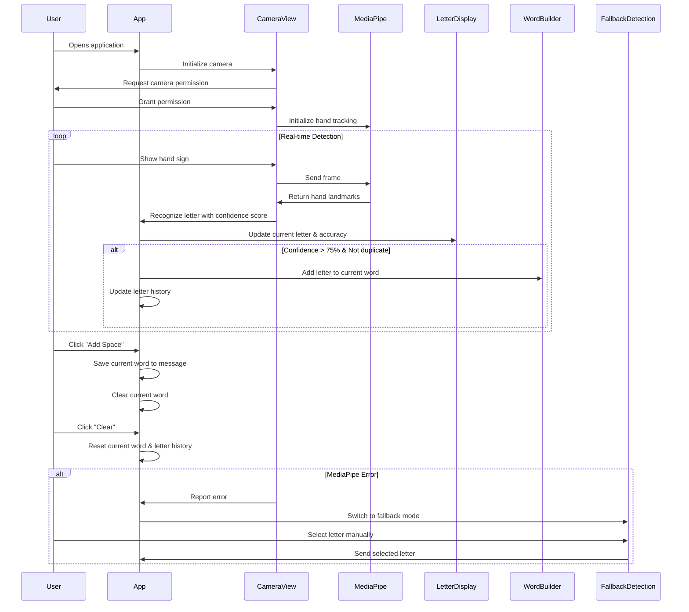

# LSE Finger Spelling Recognition App

A web application that recognizes Spanish Sign Language (LSE) finger spelling using computer vision.

## Features

### Real-time Sign Language Recognition
- Detects and recognizes letters from Spanish Sign Language (LSE) finger spelling
- Uses the device camera to capture hand gestures in real-time
- Displays the currently detected letter along with confidence percentage

### Intelligent Letter Detection
- Filters detections based on confidence level (>75%) to minimize errors
- Prevents duplicate letter detection to improve accuracy
- Shows confidence score for transparency in the recognition process

### Word Formation
- Automatically forms words from detected letters
- Add spaces with the "Add Space" button to separate words
- Clear current input with the "Clear" button
- Displays current word being formed with a blinking cursor

### Message Composition
- Builds complete messages from formed words
- Displays the full message history for reference
- Provides an intuitive interface for building sign language communications

### Letter History
- Displays the last 10 detected letters for reference
- Helps users track what has been recognized recently

### Accessibility Features
- Fallback detection mode if camera access or MediaPipe fails
- Alternative manual letter selection when automatic detection isn't available

### Privacy-Focused
- All processing is done locally on your device
- No data is sent to external servers
- Completely private sign language recognition

### Responsive Design
- Clean, modern user interface with clear visual feedback
- Works across different device sizes
- Intuitive controls for managing detected letters and words

## How It Works

Below is a sequence diagram illustrating the application's flow:

## Getting Started

1. Clone the repository
2. Install dependencies with `npm install`
3. Start the development server with `npm start`
4. Allow camera access when prompted
5. Position your hand in the camera view and form LSE finger spelling signs

## Requirements

- Modern web browser with JavaScript enabled
- Camera access for sign detection
- Sufficient lighting for optimal recognition

## Technology

Built using React and MediaPipe for hand pose detection and gesture recognition.

