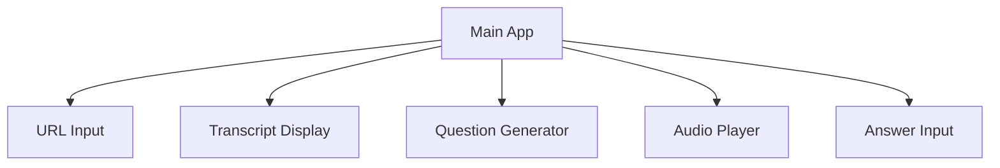

# Frontend Technical Analysis

## Component Architecture

### Main Page Components


## API Integration Points

### Transcript Fetching
```python
async def fetch_transcript(video_url: str) -> dict:
    response = await api.post("/transcript", json={"url": video_url})
    return response.json()
```

### Question Generation
```python
async def generate_questions(transcript: str, level: str) -> list:
    response = await api.post("/questions", 
        json={
            "transcript": transcript,
            "jlpt_level": level
        })
    return response.json()
```

## State Management
- Use Streamlit session state for user progress
- Cache API responses for performance
- Store user preferences locally

## UI/UX Considerations (aqui voy)
1. Japanese font support
2. Furigana display
3. Audio controls
4. Input methods (keyboard/voice)

## Error Handling
- Network connectivity issues
- Invalid YouTube URLs
- API timeouts
- Unsupported content

## Performance Optimizations
1. Lazy loading of audio content
2. Transcript caching
3. Progressive loading for long content
4. Client-side text processing
