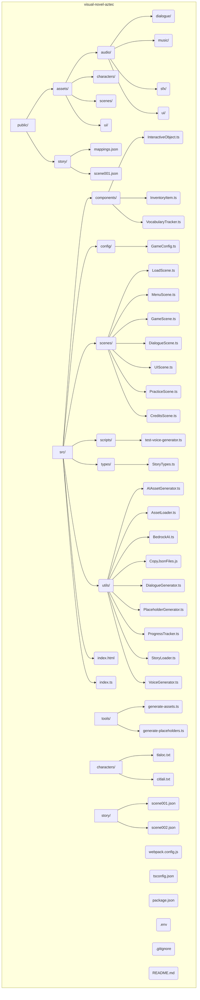

# Aztec Escape: Japanese Language Learning Visual Novel

A web-based educational game that combines Japanese language learning with an engaging escape room scenario set during the Spanish conquest of the Aztec Empire. Players must help two Aztec nobles escape imprisonment by solving puzzles in Japanese.

## Features

- Interactive visual novel with escape room mechanics
- Japanese language puzzles suitable for beginners (JLPT N5 level)
- Timer-based gameplay with penalties for wrong answers
- Optional English translations to assist learning
- Multiple difficulty levels for puzzles
- Voice-acted Japanese dialogue
- Beautiful AI-generated art assets
- Vocabulary tracking and spaced-repetition learning

## Technologies Used

- **Game Engine**: Phaser 3
- **Language**: TypeScript
- **Build System**: Webpack
- **Font Loading**: WebFontLoader
- **Audio**: Web Audio API
- **Storage**: LocalStorage for game progress

## AI Tools Integration

This project demonstrates the integration of various AI tools for game development:

### Asset Generation
- **Stable Diffusion** for background scenes and character portraits
- **AWS Bedrock** for UI elements and image variations

### Voice Synthesis
- **Amazon Polly** for Japanese dialogue with character-specific voices

### Dynamic Content
- **Ollama** (with Llama 3) for generating dialogue and puzzles
- **AWS Bedrock Claude** for cultural and educational content

## Project Structure



## Getting Started

### Prerequisites
- Node.js (v18+ recommended)
- npm or yarn
- AWS Account (for Polly and Bedrock features)
- Local Stable Diffusion setup or API access (for image generation)

### Node.js Version Management
This project works best with Node.js v18 or later due to improved ES modules support. We recommend using nvm (Node Version Manager) to easily switch between Node.js versions:

```bash
# Install nvm (if not already installed)
curl -o- https://raw.githubusercontent.com/nvm-sh/nvm/v0.39.3/install.sh | bash

# Install and use Node.js v18
nvm install 18
nvm use 18

# Verify version
node --version
```

### Installation

1. Clone the repository
```bash
git clone https://github.com/yourusername/aztec-escape.git
cd aztec-escape
```

2. Install dependencies
```bash 
npm install
```

3. Configure AWS credentials (for Polly and Bedrock)
Create a `.env` file in the project root with:
