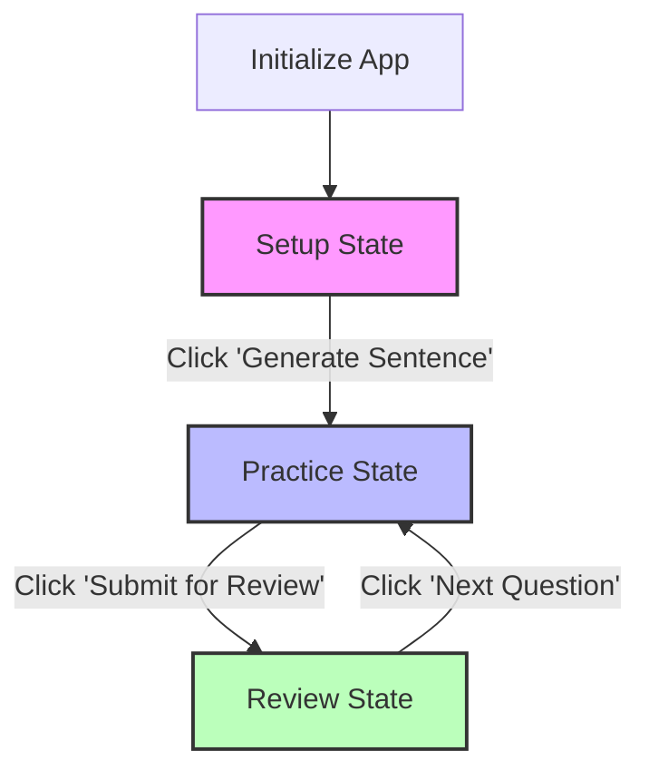
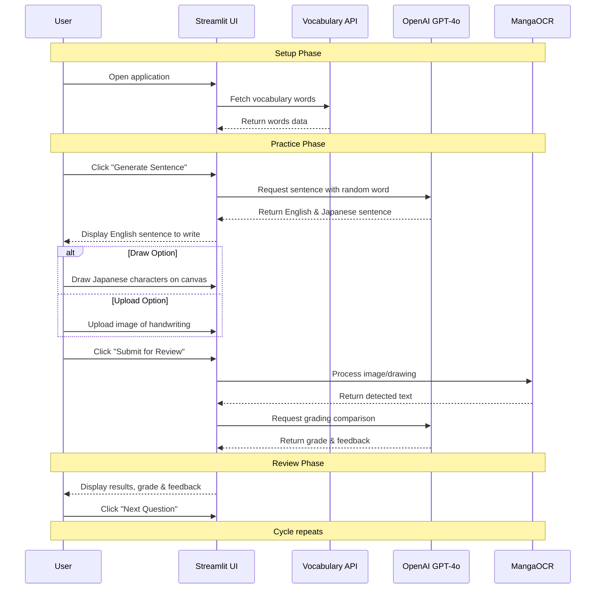
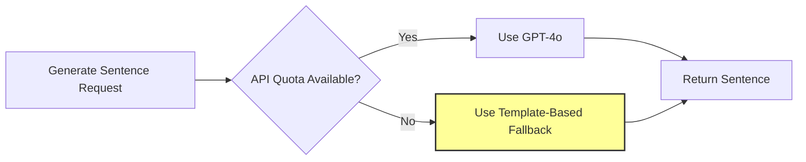

# Japanese Writing Practice Application

This application helps students practice writing Japanese sentences by providing English sentences to translate, a canvas to draw or upload handwritten Japanese text, and AI-powered feedback on their writing.

## Setup Instructions

1. Clone this repository
2. Ensure you have Python 3.10 installed:
   ```bash
   # Check your Python version
   python3 --version
   
   # If you don't have Python 3.10, install it using your package manager
   # For macOS with Homebrew:
   # brew install python@3.10
   
   # For Ubuntu/Debian:
   # sudo apt install python3.10 python3.10-venv
   ```
   
3. Create and activate a virtual environment with Python 3.10:
   ```bash
   # Create a virtual environment with Python 3.10
   # On macOS/Linux:
   python3.10 -m venv venv
   
   # On Windows (if python3.10 is in your PATH):
   python3.10 -m venv venv
   # OR specify the full path:
   # C:\Path\to\Python310\python.exe -m venv venv
   
   # Activate the virtual environment
   # On Windows:
   venv\Scripts\activate
   # On macOS/Linux:
   source venv/bin/activate
   ```
   
4. Install the required dependencies:
   ```bash
   pip install -r requirements.txt
   ```

5. Create a `.env` file based on `.env.example` and add your OpenAI API key
6. Ensure the vocabulary API is running at localhost:5000
7. Start the Streamlit app:
   ```bash
   streamlit run app.py
   ```

## How the Application Works

The application flows through three main states:

**Note:** The diagrams below use Mermaid syntax and will render automatically when viewed on GitHub. If viewing locally, you can copy and paste the code into a Mermaid live editor at https://mermaid.live to see the visualization.




### Detailed Component Interaction




### Fallback Mechanism

When the OpenAI API quota is exceeded, the application automatically switches to a template-based approach:




## How to Use

1. Click "Generate Sentence" to get an English sentence
2. Either draw the Japanese translation on the canvas or upload an image
3. Click "Submit for Review" to get feedback on your writing
4. Review your grade and feedback
5. Click "Next Question" to continue practicing

## Technical Details

- The application uses Streamlit for the frontend
- MangaOCR for Japanese text recognition
- OpenAI GPT-4o for sentence generation and grading
- Consumes an external API for Japanese vocabulary data

## Requirements

- Python 3.10 or higher
- OpenAI API key
- Access to the vocabulary API at localhost:5000
- Internet connection for API calls

## Troubleshooting

### API Quota Issues

If you encounter the error "You exceeded your current quota, please check your plan and billing details":

1. The application will automatically switch to a fallback mode that uses:
   - Template-based sentence generation instead of OpenAI
   - Simple character matching for grading instead of AI evaluation

2. To resolve the API quota issue and return to full functionality:
   - Go to [OpenAI API Dashboard](https://platform.openai.com/account/usage)
   - Check your current usage and billing status
   - If needed, update your billing information or switch to a paid plan
   - Generate a new API key at [API Keys Page](https://platform.openai.com/account/api-keys)
   - Update your `.env` file with the new key
   - Restart the application

Alternatively, you can use a different OpenAI account with available credits.

### OCR Issues

If the OCR functionality isn't working properly:

1. Ensure you have properly installed manga-ocr and its dependencies
2. Try with clearer handwriting or a higher contrast image
3. Check the console for specific error messages
